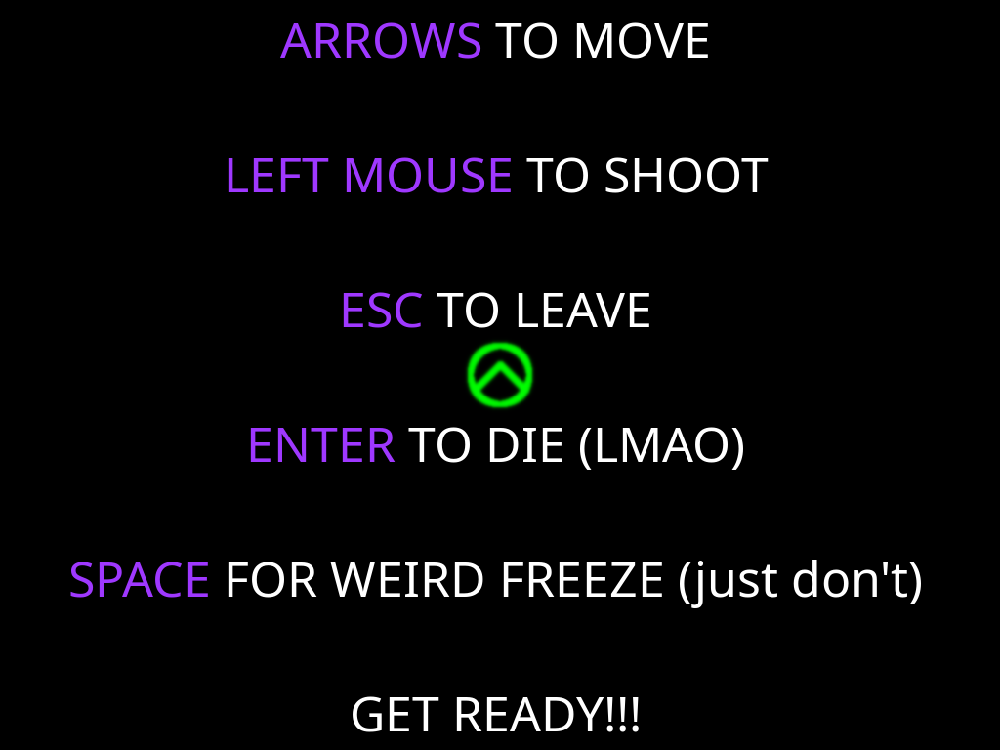

# geometry\_warcraft



# Usage
```
git clone https://github.com/archqua/geometry_warcraft.git
make && make clean
./main
```

To see bounding boxes and collision shapes `make debug && make clean`.


# Dependencies

All you need is `libc`, `git`, `g++`, `make` and `libx11-dev`.
